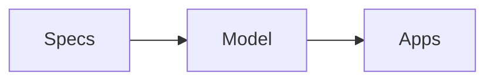

# Presentations App

## What it does

The Presentations app renders markdown files as slide presentations using [reveal.js](https://revealjs.com/). It uses a self-contained raw HTML page so reveal.js's document-wide layout, overview, and print styles are not mixed with Hearth's host stylesheet. Files live in the `/Presentations/` folder at the workspace root.

## File format

Each `.md` file in `/Presentations/` is one presentation.

### Frontmatter (optional)

YAML-style frontmatter at the very top of the file, delimited by `---`:

```yaml
---
title: My Great Deck
theme: default
transition: slide
slideNumber: true
---
```

- `title` — display name in the file picker (falls back to filename)
- `theme` — visual theme: `default` (the built-in warm, readable theme)
- `transition` — reveal.js transition: `slide`, `fade`, `none`, `convex`, `zoom`
- `slideNumber` — `true` or `false` (default: shown)

### Slides

Reveal’s Markdown plugin renders the deck. Separate main (horizontal) slides with `---` on its own line. Use `----` (four or more dashes) to create a vertical child slide below the preceding slide — ideal for diagrams or optional detail.

````markdown
# Slide Title

- Bullet one
- Bullet two

---

## Next Slide

More content, including **bold**, *italic*, `code`, and [links](https://example.com).

----

## Diagram / optional detail

Press Down to enter this vertical slide; press Up to return to the main slide.

```js
console.log("code blocks work too");
```
````

### Mermaid diagrams

Use a fenced code block labeled `mermaid`. The presentation app renders it as a responsive SVG chart rather than displaying the diagram source:

````markdown

````

Diagrams automatically match the presentation's light or dark mode.

### Speaker notes

Add `<!-- notes: ... -->` HTML comments anywhere in a slide:

```markdown
# Quarter Results

Revenue up 40%

<!-- notes: Don't forget to mention the new enterprise deals -->
```

- Press **N** or **S**, or click **Speaker Notes** (notebook pen icon) in the top bar to toggle the in-app speaker notes drawer.

## Presenting

| Key | Action |
| --- | --- |
| Arrow keys / Space | Navigate slides — use **Down/Up** for vertical child slides |
| F | Fullscreen |
| N / S | Toggle in-app speaker notes drawer |
| O / Esc | Slide overview grid |

## Exporting to PDF

Click **📄 PDF** in the presentation toolbar. The app initializes the deck directly in reveal.js's documented `print-pdf` view, waits for reveal.js to finish generating one printable page per slide, then calls the browser print dialog from the presentation iframe; choose **Save as PDF** as the destination.

For best results, use landscape orientation, turn on background graphics, set margins to none, and turn **Headers and footers** off (the exact labels depend on the browser). Browser-generated headers and footers—such as the URL, date, and page number—cannot be removed by the app's CSS. The app hides its toolbar, speaker notes, and reveal.js slide numbers from the exported document.

## Creating a presentation

1. Create a `.md` file in `/Presentations/`
2. Write slides separated by `---`
3. Open the Presentations app and click the file

The app watches for file changes — edit the markdown in another tab and the presentation updates live.

## Capabilities

- **Filesystem:** readwrite access to `/Presentations/`
- **Network:** loads reveal.js, Mermaid, and syntax-highlighting assets from `esm.sh`
- **Sandbox:** `allow-presentation` for presenting on external displays
